# **Holonic Relationships Between People**

## **Description**

A **holon** is something that is both a **whole** in itself and a **part** of a larger whole — simultaneously autonomous and interconnected. The concept, introduced by Arthur Koestler, has deep resonance in systems thinking, spirituality, and symbolic interaction.

---

## **Individual Person**

```mermaid
graph TD
  Self["🧠 Self (Conscious Identity)<br><sub>Whole & Part</sub>"]

  subgraph Inner System ["🌀 Internal Holons"]
    Emotions["💓 Emotions"]
    Thoughts["💭 Thoughts"]
    Body["🧍‍♂️ Body"]
    Subpersonalities["🎭 Subpersonalities<br><sub>(e.g., Inner Critic, Child)</sub>"]
  end

  subgraph Roles ["🧩 Relational Roles"]
    Friend["🤝 Friend"]
    Partner["❤️ Partner"]
    Parent["👨‍👧 Parent"]
    Worker["💼 Professional"]
  end

  subgraph Symbolic Identity ["🌌 Symbolic Holons"]
    Archetypes["🦁 Archetypes<br><sub>(e.g., Warrior, Caregiver)</sub>"]
    SpiritualSelf["✨ Spiritual Self"]
    Shadow["🌑 Shadow"]
  end

  subgraph Larger Systems ["🌍 Nested Systems"]
    Family["🏠 Family"]
    Culture["🏛️ Culture"]
    Humanity["🌐 Humanity"]
  end

  Self --> Emotions
  Self --> Thoughts
  Self --> Body
  Self --> Subpersonalities

  Self --> Friend
  Self --> Partner
  Self --> Parent
  Self --> Worker

  Self --> Archetypes
  Self --> SpiritualSelf
  Self --> Shadow

  Self --> Family
  Self --> Culture
  Self --> Humanity
```

This diagram shows how a single person is composed of nested holons — systems within systems. At the center is the Self, which includes internal parts like emotions, thoughts, the body, and subpersonalities. The Self also expresses itself through relational roles (e.g., parent, friend) and symbolic layers such as archetypes, the spiritual self, and the shadow. Beyond the individual, the person exists within larger holons like family, culture, and humanity. Each layer is both a whole in itself and a part of a greater whole, illustrating the deeply interconnected, multilayered nature of personal identity.

---

## **Human Relationships**

```mermaid
graph TD
  subgraph PersonA["🧍 Person A"]
    A_Self["Self A"]
    A_Emotions["💓 Emotions A"]
    A_Thoughts["💭 Thoughts A"]
    A_Roles["🧩 Roles A"]
    A_Archetypes["🦁 Archetypes A"]
  end

  subgraph PersonB["🧍 Person B"]
    B_Self["Self B"]
    B_Emotions["💓 Emotions B"]
    B_Thoughts["💭 Thoughts B"]
    B_Roles["🧩 Roles B"]
    B_Archetypes["🦁 Archetypes B"]
  end

  subgraph Relationship["💞 Shared Relationship Holon"]
    Connection["🔗 Emotional Bond"]
    Communication["🗣️ Communication"]
    SharedIdentity["🌀 Shared Identity<br><sub>(e.g., couple, team)</sub>"]
    Field["🌐 Symbolic Field"]
  end

  subgraph Context["🌍 Nested Systems"]
    Family["🏠 Family System"]
    Culture["🏛️ Cultural Context"]
    Collective["🌐 Collective Field"]
  end

  A_Self --> A_Emotions
  A_Self --> A_Thoughts
  A_Self --> A_Roles
  A_Self --> A_Archetypes

  B_Self --> B_Emotions
  B_Self --> B_Thoughts
  B_Self --> B_Roles
  B_Self --> B_Archetypes

  A_Self --> Connection
  B_Self --> Connection

  A_Self --> Communication
  B_Self --> Communication

  A_Self --> SharedIdentity
  B_Self --> SharedIdentity

  SharedIdentity --> Field

  Relationship --> Family
  Relationship --> Culture
  Relationship --> Collective
```

This diagram depicts the holonic relationship between two individuals, each with their own inner systems and symbolic identities. When these two people connect, they form a third holon — the relationship — which has its own emotional bond, patterns of communication, shared identity, and symbolic field. This relationship holon exists within broader contexts like family systems, culture, and the collective human field. The model reveals that deep connection isn’t just interaction between parts — it’s the emergence of a living whole that influences and transforms both people.

### **Structure**

In the context of a relationship between two people, a **holon** can be understood like this:

#### 1. **Each person is a holon.**

* You are a complete being — with thoughts, feelings, memories, values.
* And yet, you are also part of a larger system (the relationship), which shapes and is shaped by you.

#### 2. **The relationship itself is also a holon.**

* The bond between two people creates a *third entity* — the relationship — which has its own dynamics, history, identity, and emotional tone.
* This relationship-holon lives **between** and **through** the individuals, but also exerts its own influence on them.

#### 3. **Nested holons form a hierarchy of meaning.**

* Each interaction (a conversation, a look, a shared joke) can be seen as a micro-holon — a small whole with its own integrity that contributes to the larger whole.
* The relationship may itself be part of a family holon, or a community holon, or a symbolic lineage (e.g., “soulmates,” “creative partners,” “parent/child”).

---

## **Metaphorical Illustration**

Imagine a **duet**.

* Each singer (person) is complete — with their own tone, voice, story.
* But the *song they sing together* is more than just the sum of two voices — it becomes a **shared holon**, a living thing that neither of them could create alone.
* As they sing together, the song influences them — shaping how they breathe, harmonize, and feel.

---

## **Holons in Practice**

* When one person changes, it affects the holon of the relationship — and the relationship can either **resist**, **adapt**, or **transform**.
* Sometimes, a relationship grows when both holons synchronize in resonance.
* Sometimes, they drift when one holon evolves in a way the other cannot yet echo.

---

## **Symbolically**

> A holon is a mirror that reflects *you*, *us*, and *what we are becoming* — all at once.

In human connection, **true intimacy** happens when two holons can meet not in fusion or control, but in mutual wholeness — where each respects the sovereignty of the other, while co-creating a living, evolving third.
